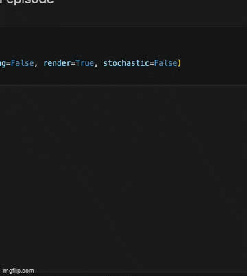

# Warehouse Robot RL

A robot operates in a warehouse grid where its task is to pick up items from specified locations and deliver them to designated drop-off points. The warehouse has shelves that act as obstacles and the robot must navigate around them efficiently.

# Preview

A preview of the ENV is as below. For simplicity the position of the objects in the env are fixed. Once, we move towards training the model, the positions will be randomly generarted.



# Steps to configure ENV

- Create a python virtual environment and activate it.
```CMD
python3 -m venv env
source env/bin/activate
```
- Install all the dependencies from the requirements.txt.
```CMD
pip install -r requirements.txt
```
- Run all the cells inside "warehouse_robot_train.ipynb".

# Folder Structure

## Part I

- warehouse_robot.py - This file has the logic implementation for the warehouse robot for all the requred steps for Gym. The visualisation using pygame is included in this file.
- warehouse_robot_env.py - This file has the Gym implementation for warehouse robot env. The function logic from `warehouse_robot.py` file are used here. This file includes Gym model registration.

## Part II

- warehouse_robot_train.ipynb - This file contains the Q-Learning and Double Q-Learning implementation for the WarehouseRobotEnv. The file contains -
    - Implementation of Q-Learning model.
    - Training the Q-Learning model for Deterministic and Stochastic Environment.
    - Running the model for 10 episodes to check rewards obtained by the robot.
    - Hyperparameter Tuning for Discount Factor and Epsilon Decay and conclusion for the same.
    - Implementing the Double Q-Learning model.
    - Training the Double Q-Learnign model for Deterministic and Stochastic Environment.
    - Running the model for 10 episodes to check the rewards obtained by the robot.
- vo_warehouse_solution_without_stochastic.pkl - Pickle file for Deterministic Q-Learning model trained over 1000 episodes.
- vo_warehouse_solution_stochastic.pkl - Pickle file for Stochastic Q-Learning model trained over 1000 episodes.
- vo_warehouse_double_q_learning_1.pkl & vo_warehouse_double_q_learning_2.pkl - Pickle file for Deterministic Q-Learning model trained over 1000 episodes.
- vo_warehouse_double_q_learning_stochastic_1.pkl & vo_warehouse_double_q_learning_stochastic_2.pkl - Pickle file for Deterministic Q-Learning model trained over 1000 episodes.
- warehouse_robot.gif - GIF for rendering the deterministic warehouse robot for 1 episode using Q-Learning. 
- warehouse_robot_double_q_learning.gif - GIF for rendering the deterministic warehouse robot for 1 episode using Double Q-Learning.

## Part III

- stock_trading.ipynb - This file contains the Stock Environment and the Q-Learning implementation for the same. It also contains the analysis for the same.
- stock_trading.pkl - The pickel file for trainig the StockTradingEnvironment using Q-Learning.
- NVDA.csv - The provided CSV file for model training.

## Reports
- apurvaba_assignment_Report.pdf - The final complete report compiling all the outcomes and analysis for the same. This includes Part I, Part II and Part III. The bonus parts are re-implemented and added in the same report.
